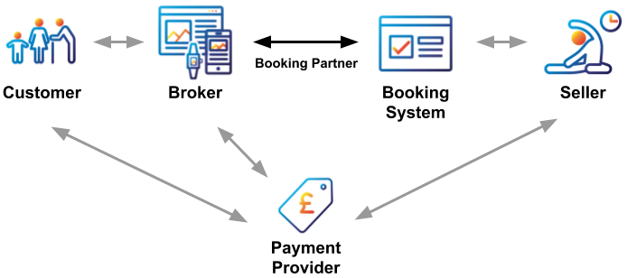
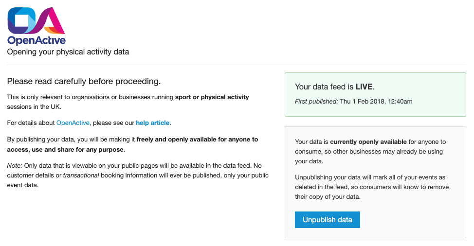
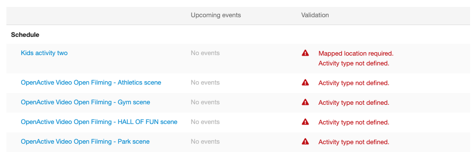

# Design Considerations

## Key Actors

For context, the following are the key actors involved in a transaction using the Open Booking API.

| Actor | Description |
| :--- | :--- |
| **Customer** | The user who places a booking using an application provided by a [Broker](https://www.openactive.io/open-booking-api/#dfn-broker). The [Customer](https://www.openactive.io/open-booking-api/#dfn-customer) is not necessarily the attendee, e.g. a parent may book on behalf of their child. |
| **Broker** | The Broker is the organisation or developer providing an application that allows [Customers](https://www.openactive.io/open-booking-api/#dfn-customer) to make bookings. The third party that is granted [authentication credentials](https://www.openactive.io/open-booking-api/#authentication) should be termed a "**Booking Partner**" in any Seller-facing user-interface, and may represent more than one Customer-facing Broker. |
| **Booking System** | The organisation or developer providing an application that maintains bookable inventory on behalf of the [Seller](https://www.openactive.io/open-booking-api/#dfn-seller). |
| **Seller** | The organisation or individual providing access to events or facilities via a [Booking System](https://www.openactive.io/open-booking-api/#dfn-booking-system) e.g. a leisure provider running yoga classes. |
| **Payment Provider** | The notional service providing payment processing between the [Customer](https://www.openactive.io/open-booking-api/#dfn-customer), [Broker](https://www.openactive.io/open-booking-api/#dfn-broker) and [Seller](https://www.openactive.io/open-booking-api/#dfn-seller). |

## Booking System Architecture

Following this guide it is useful to ascertain which of the following architectures your booking system conforms to:

* **Single Seller**: The booking system either supports a single Seller by design \(e.g. an agency build for a specific organisation\), or the booking system is designed to have a database provisioned for each customer \(e.g. larger leisure management solutions deployed on-premise or cloud hosted\).
* **Multiple Sellers**: The booking system is multi-tenancy within the same database, so for example multiple Sellers are able to log in and manage sessions and facilities within the same underlying database \(e.g. a booking system targeting at a large number of small/medium size activity providers\).

This will be useful when following the instructions in the guide.

## OpenActive data publishing "tick box"

Where they **do not** own the data, Booking Systems must offer each Seller an "**Enable OpenActive data publishing**" tickbox or other mechanism to enable OpenActive data publishing.

For Booking Systems that own the data, this is not required, and OpenActive data publishing can be enabled system-wide with appropriate communication to Sellers where necessary.

### OpenActive data publishing event-level "tick-box"

Some booking systems offer an event-level override to "filter out" events that are not desirable to be published openly. Such a feature should be considered based on customer demand.

## OpenActive booking partners

Booking Systems are advised **not** to use a single "tickbox" to enable Open Booking at the Seller level, and instead design around the concept of individual booking partner "approval".

Open Booking is all about relationships between the Seller and individual Brokers, where the Seller remains in ultimate control of the relationship, and hence emphasising the control available over each relationship is important. The booking partner is the authenticating party, which may represent multiple Brokers.

The preferred approach is to provide Sellers with an mechanism to approve individual booking partners within your booking system.

See Authentication guide for more information.

### OpenActive booking event-level "tick box"

Booking Systems may opt to include an "**Bookable via OpenActive**" tick box at the **Event** level, however note that such a setting would apply to **all** Booking Partners and that this information is published in the open feed. The Open Booking API does not provide a mechanism for granular by-broker-by-event level control by design, in order to reduce complexity overall, and instead encourages trust-based relationships between Brokers and Sellers with auditing.

## Terms URLS

Booking Systems should provide a mechanism for the Seller to specify their Terms and Conditions and Privacy Policy URLs, to be passed through to the Broker.

## Customer notice notifications

Booking Systems may include a mechanism for triggering a [Customer notice notification](https://www.openactive.io/open-booking-api/EditorsDraft/#customer-notice-notifications), which notifies all customers via all brokers using a message that the Seller sets.

## Validation UI

A validation UI should be provided give the Seller hints as to which additional fields are required to make their data useful for OpenActive \(both open data publishing and booking\).

This should include a note for which additional attendee questions will not be captured, or a notice that providing additional attendee questions may limit the number of brokers that use their data.

## Restriction rendering

Booking Systems may present an example rendering of how any currently configured restrictions are rendered as [additionalAdmissionRestriction](https://www.openactive.io/open-booking-api/EditorsDraft/#booking-restrictions) if they are not covered by ageRestriction or genderRestriction.

## Reporting

Booking Systems may also want to consider reporting requirements \(e.g. how many bookings were made by which broker over various timeframes, total value of these bookings, etc\)?

