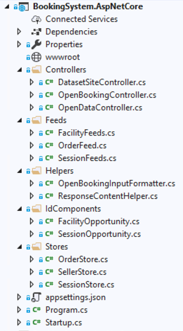

# StoreBookingEngine

## Overall Objective

This guide will help you implement StoreBookingEngine within a target development window of 8 days, creating an implementation of the [Open Booking API](https://www.openactive.io/open-booking-api/EditorsDraft/).

### Introduction

The **`StoreBookingEngine`** is essentially a number of abstract classes which can be implemented to create a fully operation Open Booking API.

The [BookingSystem.AspNetCore](https://github.com/openactive/OpenActive.Server.NET/tree/master/Examples/BookingSystem.AspNetCore) project provides a good example of an implementation of **`StoreBookingEngine`** using a [**OpenActive.FakeDatabase.NET**](https://github.com/openactive/OpenActive.Server.NET/tree/master/Fakes/OpenActive.FakeDatabase.NET) - which offers a fake implementation of a booking system backend.

The following are required for a minimal implementation:

* **Feeds** -  generate the RPDE feeds
* **Stores** - methods to execute various booking operations that are executed by the **`StoreBookingEngine`**
* **IdComponents** - customisable composite IDs to represent the key entities within your system
* **Startup.cs** - configuration of the **`StoreBookingEngine`**

 Additionally, the following are required to bind the **`StoreBookingEngine`** to the web framework:

* **Helpers** - convert JSON requests to string, and responses to controller return types.
* **Controllers** - call the **`StoreBookingEngine`** from the Open Booking API endpoints.

