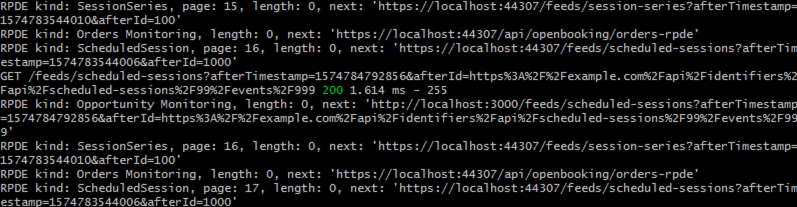
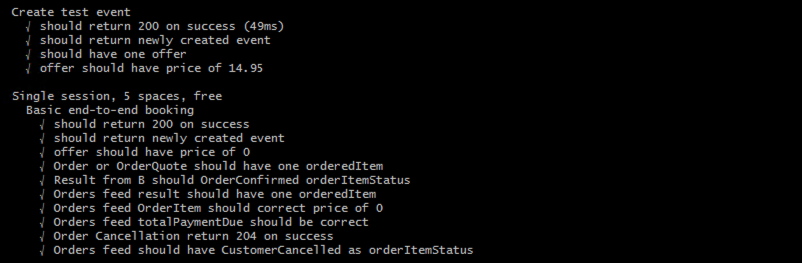

# Day 1: Fake Implementation

## **Objective for Day 1**

Create a fully working implementation of the [Open Booking API](https://www.openactive.io/open-booking-api/EditorsDraft/) by using [FakeDatabase](https://www.nuget.org/packages/OpenActive.FakeDatabase.NET/) within your application.

### Rationale

Having a fully working implementation allows you to easily see what needs to be achieved, and also provides an easy way to ensure that the test suite and libraries are behaving as expected within your environment.

## **Step 1 - Copy files**

Copy the files within the `Feeds`, `Helpers`, `IdComponents`, `Settings`, and `Stores` directories from the [example project](https://github.com/openactive/OpenActive.Server.NET/tree/master/Examples/BookingSystem.AspNetCore) into your application, and add the dependencies [OpenActive.Server.NET](https://www.nuget.org/packages/OpenActive.Server.NET/) and [OpenActive.FakeDatabase.NET](https://www.nuget.org/packages/OpenActive.FakeDatabase.NET/). FakeDatabase.NET is an in-memory fake database that is not persisted, and will allow you to create a quick working Open Booking API.

Inspect the `Controllers` and copy the files \(or the contents of the files\) as appropriate for your application.

Note you will be creating the following endpoints \(as per the [Open Booking API specification](https://www.openactive.io/open-booking-api/EditorsDraft/#paths-and-verbs)\):

* Dataset Site
* Open Data RPDE feeds
* OrderQuote Creation \(C1\)
* OrderQuote Creation \(C2\)
* OrderQuote Deletion
* Order Creation \(B\)
* Order Deletion
* Order Cancellation
* Orders RPDE Feed
* Order Status

Additionally you will be creating two endpoints for use with the test suite \(not for use in production\):

* Test Harness Event Creation
* Test Harness Event Deletion

A further endpoint is required to meet the [recommendations outlined for authentication](day-8-authentication/), however this can be added as part of Day 8 as it has it is not a dependency of Days 1-7: 

* Dynamic Client Update

## Step 2 - Copy configuration

Inspect the `Startup.cs` \(.NET Core\) or `ServiceConfig.cs` \(.NET Framework\) and copy the `services.AddSingleton<IBookingEngine>(...)` configuration into your own `Startup.cs` or `ServiceConfig.cs`.

The initial objective is to get a working version of the Open Booking API using entirely fake data. So when copying these files do not modify the configuration values at this stage - simply use them as-is.

## Step 2 - Controller endpoint bindings

The `ResponseContent` class provides a .NET version agnostic representation of HTTP responses from the Booking Engine. Two example helper methods are provided to be used with your version of .NET. See `ResponseContentHelper.cs`in the example projects.

### .NET Core

The following extension method can be used to return an `Mvc.ContentResult`.

```bash
public static Microsoft.AspNetCore.Mvc.ContentResult GetContentResult(this OpenActive.Server.NET.OpenBookingHelper.ResponseContent response)
{
    return new Microsoft.AspNetCore.Mvc.ContentResult
    {
        StatusCode = (int)response.StatusCode,
        Content = response.Content,
        ContentType = response.ContentType
    };
}
```

### .NET Framework

The following extension method can be used to return an `HttpResponseMessage`.

```bash
public static HttpResponseMessage GetContentResult(this OpenActive.Server.NET.OpenBookingHelper.ResponseContent response)
{
    var resp = new HttpResponseMessage
    {
        Content = response.Content == null ? null : new StringContent(response.Content),
        StatusCode = response.StatusCode
    };
    resp.Content.Headers.ContentType = MediaTypeHeaderValue.Parse(response.ContentType);
    return resp;
}
```

## **Step 3 - Input Formatter**

The Booking Engine accepts input JSON as `string` in order to fully control deserialisation. In order to allow the web framework to capture the body of the request as a `string`, for the [Open Booking API's media type](https://www.openactive.io/open-booking-api/EditorsDraft/#media-types), an `InputFormatter` is required.  See `OpenBookingInputFormatter.cs`in the example projects.

### .NET Core

```csharp
services
    .AddMvc()
    .AddMvcOptions(options => options.InputFormatters.Insert(0, new OpenBookingInputFormatter()))
```

```csharp
public class OpenBookingInputFormatter : InputFormatter
{
    public OpenBookingInputFormatter()
    {
        this.SupportedMediaTypes.Add(OpenActiveMediaTypes.OpenBooking.Version1);
    }

    public override async Task<InputFormatterResult> ReadRequestBodyAsync(InputFormatterContext context)
    {
        var request = context.HttpContext.Request;
        using (var reader = new StreamReader(request.Body))
        {
            var content = await reader.ReadToEndAsync();
            return await InputFormatterResult.SuccessAsync(content);
        }
    }

    protected override bool CanReadType(Type type)
    {
        return type == typeof(string);
    }
}
```

### .NET Framework

```csharp
config.Formatters.Add(new OpenBookingInputFormatter());
```

```csharp
public class OpenBookingInputFormatter : MediaTypeFormatter
{
    public OpenBookingInputFormatter()
    {
        this.SupportedMediaTypes.Add(MediaTypeHeaderValue.Parse(OpenActiveMediaTypes.OpenBooking.Version1));
    }

    public override Task<object> ReadFromStreamAsync(Type type, Stream readStream, HttpContent content, IFormatterLogger formatterLogger)
    {
        var taskCompletionSource = new TaskCompletionSource<object>();
        try
        {
            var memoryStream = new MemoryStream();
            readStream.CopyTo(memoryStream);
            var s = System.Text.Encoding.UTF8.GetString(memoryStream.ToArray());
            taskCompletionSource.SetResult(s);
        }
        catch (Exception e)
        {
            taskCompletionSource.SetException(e);
        }
        return taskCompletionSource.Task;
    }

    public override bool CanReadType(Type type)
    {
        return type == typeof(string);
    }

    public override bool CanWriteType(Type type)
    {
        return false;
    }
}
```

## **Step 4 - Authentication Helper**

The Booking Engine does not handle authentication, and instead accepts claims from an authentication layer in front of it \(this will be covered in more detail in [Day 8](day-8-authentication/)\). An AuthenticationHelper is provided for .NET Core and .NET Framework that extracts OAuth 2.0 claims from access tokens, and also provides simple header alternatives to facilitate development and testing.

Note that these test header alternatives are not secure and **must not** be used in production, however they will be used for Day 1-7 of this guide.

### .NET Core

```csharp
(string clientId, Uri sellerId) = AuthenticationHelper.GetIdsFromAuth(Request, User);
return bookingEngine.ProcessCheckpoint1(clientId, sellerId, uuid, orderQuote).GetContentResult();                
```

```csharp
public static class AuthenticationHelper
{
    public static (string clientId, Uri sellerId) GetIdsFromAuth(HttpRequest request, ClaimsPrincipal principal, bool requireSellerId)
    {
        // NOT FOR PRODUCTION USE: Please remove this block in production
        if (request.Headers.TryGetValue(AuthenticationTestHeaders.ClientId, out StringValues testClientId)
            && testClientId.Count == 1
            && (!requireSellerId || (request.Headers.TryGetValue(AuthenticationTestHeaders.SellerId, out StringValues testSellerId) && testSellerId.FirstOrDefault().ParseUrlOrNull() != null))
            )
        {
            return (testClientId.FirstOrDefault(), testSellerId.FirstOrDefault().ParseUrlOrNull());
        }

        // For production use: Get Ids from JWT
        var clientId = principal.GetClientId();
        var sellerId = principal.GetSellerId().ParseUrlOrNull();
        if (clientId != null && (sellerId != null || !requireSellerId))
        {
            return (clientId, sellerId);
        }
        else
        {
            throw new OpenBookingException(new InvalidAPITokenError());
        }
    }

    public static (string clientId, Uri sellerId) GetIdsFromAuth(HttpRequest request, ClaimsPrincipal principal)
    {
        return GetIdsFromAuth(request, principal, true);
    }

    public static string GetClientIdFromAuth(HttpRequest request, ClaimsPrincipal principal)
    {
        return GetIdsFromAuth(request, principal, false).clientId;
    }
}
```

### .NET Framework

```csharp
(string clientId, Uri sellerId) = AuthenticationHelper.GetIdsFromAuth(Request, User);
return _bookingEngine.ProcessCheckpoint1(clientId, sellerId, uuid, orderQuote).GetContentResult();
```

```csharp
public static class AuthenticationHelper
{
    private static (string clientId, Uri sellerId) GetIdsFromAuth(HttpRequestMessage request, IPrincipal principal, bool requireSellerId)
    {
        // NOT FOR PRODUCTION USE: Please remove this block in production
        IEnumerable<string> testSellerId = null;
        if (request.Headers.TryGetValues(AuthenticationTestHeaders.ClientId, out IEnumerable<string> testClientId)
            && testClientId.Count() == 1
            && (!requireSellerId || (request.Headers.TryGetValues(AuthenticationTestHeaders.SellerId, out testSellerId) && testSellerId.FirstOrDefault().ParseUrlOrNull() != null))
            )
        {
            return (testClientId.FirstOrDefault(), testSellerId?.FirstOrDefault().ParseUrlOrNull());
        }

        // For production use: Get Ids from JWT
        var claimsPrincipal = principal as ClaimsPrincipal;
        var clientId = claimsPrincipal.GetClientId();
        var sellerId = claimsPrincipal.GetSellerId().ParseUrlOrNull();
        if (clientId != null && (sellerId != null || !requireSellerId))
        {
            return (clientId, sellerId);
        }
        else
        {
            throw new OpenBookingException(new InvalidAPITokenError());
        }
    }

    public static (string clientId, Uri sellerId) GetIdsFromAuth(HttpRequestMessage request, IPrincipal principal)
    {
        return GetIdsFromAuth(request, principal, true);
    }

    public static string GetClientIdFromAuth(HttpRequestMessage request, IPrincipal principal)
    {
        return GetIdsFromAuth(request, principal, false).clientId;
    }
}
```

## **Step 5 - Run Application**

If you run your application and navigate to the dataset site endpoint \(e.g. [https://localhost:44307/openactive](https://localhost:44307/openactive)\), you should find the following page:


Clicking on the ScheduledSessions feed should return JSON in the following format:



If some links appear broken, try updating `BaseUrl` within `Startup.cs` or `ServiceConfig.cs` with the correct port number for your local test environment.


Navigating to the Orders feed \(e.g. [https://localhost:44307/api/openbooking/orders-rpde](https://localhost:44307/api/openbooking/orders-rpde)\) should return the following JSON result \(an empty RPDE page\):


## **Step 6 - Run Test Suite**

The test suite consists of two projects:

* **openactive-broker-microservice** - harvests feeds and provides long-polling endpoints to listen for specific items.
* **openactive-integration-tests** - a series of [Mocha](https://mochajs.org/) integration tests that exercise an Open Booking API implementation.

Download both of the [Test Suite Node.js projects](https://github.com/openactive/OpenActive.Server.NET/tree/master/Test%20Suite) locally, and run the following command in both directories \(note you will need [Node.js](https://nodejs.org/en/) installed to do this - which can installed with the Visual Studio installer\):

```bash
npm install
```

Then update the following `config/default.json` files in both projects, as follows, based on the port number and path used by your .NET application when running. Note that the `microserviceApiBase` configuration value is the URL of the `openactive-broker-microservice`, which defaults to port `3000` on your local machine.




```bash
{
  "microservice": {
    "bookingApiBase": "https://localhost:44307/api/openbooking/",
    "openFeedBase": "https://localhost:44307/feeds/"
  }
}
```





```bash
{
  "tests": {
    "bookingApiBase": "https://localhost:44307/api/openbooking/",
    "microserviceApiBase": "http://localhost:3000/"
  }
}
```




### Run the Microservice

With your .NET application running, execute the following command in the `openactive-broker-microservice` directory:

```bash
npm start
```

This will start to harvest the feeds from your running application. You should see log messages similar to the following:



### Run the Integration Tests

With both your .NET application and `openactive-broker-microservice` running, execute the following command in the `openactive-integration-tests` directory:

```bash
npm test
```

This will execute tests against your .NET application, using the `openactive-broker-microservice` as an intermediary. You should see results similar to the following:



The `openactive-integration-tests` writes log files into the `output` directory for each test scenario, so you can see the endpoints that have been called, with both the requests sent and responses received.

To understand the requests and responses, please see the [explanation](https://www.openactive.io/open-booking-api/EditorsDraft/#high-level-api-flow) in the Open Booking API specification, along with the more detailed [sequence diagram](https://www.openactive.io/open-booking-api/EditorsDraft/#step-by-step-process-description) and example [requests and responses](https://www.openactive.io/open-booking-api/EditorsDraft/#paths-and-verbs).

Assuming configuration values have not been changed from the copied files, issues with the tests at this stage will very likely be due to the controller or other application configuration.

