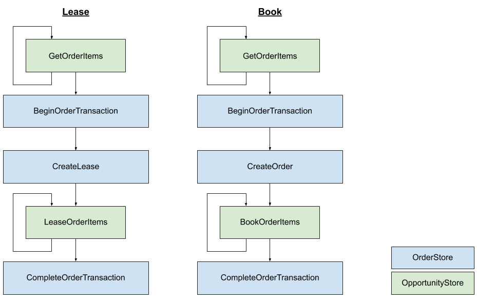
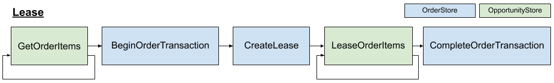
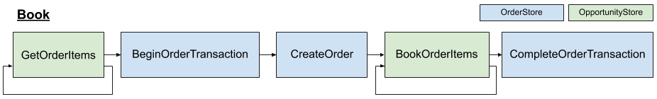

# Day 5: Leases and B

## Objective for Day 5

Implement leasing and booking.

### Rationale

With the details of the opportunity handled in Day 4, Day 5 is about ensuring that leasing and booking actually occurs.

## Step 1: Ensure your database has a compatible schema

The Open Booking API includes concepts that likely map onto your existing schema, however your database schema may require slight adjustment in order to be compatible.


| Entity | Description |
| :--- | :--- |
| Order | A table representing the atomic successfully created `Order` which is the result of [**B**](https://www.openactive.io/open-booking-api/EditorsDraft/#order-creation-b). A lease flag can also be added to this table to allow it to also represent a leased `OrderQuote`, or a separate table may be used for this purpose. It likely also include the booker details. |
| OrderItem | A table representing an individual booking of an Opportunity within an `Order`.  It likely also includes the guest checkout attendee details if these are supported. Existing "booking" or "attendee" tables may serve this purpose. Each OrderItem represents a booked space or use of [a 'bookable' Opportunity and Offer pair](https://www.openactive.io/open-booking-api/EditorsDraft/#definition-of-a-bookable-opportunity-and-offer-pair). |
| _Opportunity_ | One or many tables that represent the different [types of opportunity](https://developer.openactive.io/data-model/data-model-overview), some of which may be [bookable](https://www.openactive.io/open-booking-api/EditorsDraft/#definition-of-a-bookable-opportunity-and-offer-pair). |
| Offer | A table or other data structure that represents the available Offers within each Opportunity |
| Seller | A table that represents Sellers, organizations or individuals who organize the events or provide the facilities. Existing "organisation" tables may serve this purpose. This is only required if the booking system is multi-tenancy within the same database \(i.e. it supports multiple Sellers\). |
| AuthToken | This is likely to be managed by the authentication library, e.g. as JWT. See [Day 8](day-8-authentication/) for more information. |
| Booking Partner | This is likely to be managed by the authentication library, e.g. as a table of OAuth Clients. See [Day 8](day-8-authentication/) for more information. |

## Step 2: Understand the StoreBookingEngine booking flow

The `StoreBookingEngine` handles booking of each `OrderItem`, as well as creating the overall `Lease` or `Order` within a transaction.

The diagram below illustrates the abstract methods that are called by the `StoreBookingEngine`, noting that:

* The `OpportunityStore` used for each set of `OrderItem`s of each opportunity type is based on the  `OpenBookingStoreRouting` configured in Day 3.
* The same `OrderItemContext` is passed untouched from `GetOrderItems` to either `LeaseOrderItems` or `BookOrderItems`, which allows logic to be executed inside or outside of the transaction as required.




## Step 3: Implement OrderStore


## Step 4: Implement Transactions

Within the Orders store, implement `BeginOrderTransaction`, `CompleteOrderTransaction` and `RollbackOrderTransaction`.

## Step 5: Implement Leasing



The Open Booking API specification [provides several options for leasing](https://www.openactive.io/open-booking-api/EditorsDraft/#leasing). The implementation of each is described below.

Note that leases are time-bound, and so must be cleaned up if they expire \(e.g. on a schedule\). This must be handled outside of the `StoreBookingEngine`.

### Option 1: Disable leasing

* Ensure that `BeginOrderTransaction` returns `null`, for `FlowStage.C1`  and `FlowStage.C2`.
* Ensure `CreateLease` always returns `null`, which will prevent `LeaseOrderItems` being triggered.
* `LeaseOrderItems` can throw `NotImplementedException`.
* Implement `DeleteLease` to do nothing \([as the specification requires a positive response for OrderQuote Deletion](https://www.openactive.io/open-booking-api/EditorsDraft/#orderquote-deletion), even if no lease exists\).

```csharp
protected override DatabaseTransaction BeginOrderTransaction(FlowStage stage)
{
    // No lease support
    if (stage == FlowStage.B)
    {
        return new DatabaseTransaction(FakeBookingSystem.Database);
    }
    else
    {
        return null;
    }
}

public override Lease CreateLease(OrderQuote orderQuote, StoreBookingFlowContext context, DatabaseTransaction databaseTransaction)
{
    // No lease support
    return null;
}

public override void DeleteLease(OrderIdComponents orderId)
{
    // No lease support, simply do nothing here
}
```

### Option 2: Named leasing - lease at C2 only

Use conditional logic to return `null` from `BeginOrderTransaction` and `CreateLease` at `FlowStage.C1`.

Implement `CreateLease` to create a new lease in your database against the `flowContext.OrderId.uuid`.  

Implement `LeaseOrderItems` for each `OpportunityStore` to add the provided list of `OrderItemContext` identified by their `RequestBookableOpportunityOfferId` to the lease identified by `flowContext.OrderId.uuid`.

Implement `DeleteLease` to delete the lease based on the provided `orderId.uuid`.

Note that a  `Lease` object must be returned from `CreateLease` in order for the `LeaseOrderItems` within each `OpportunityStore` implementation to be executed.

```csharp
protected override DatabaseTransaction BeginOrderTransaction(FlowStage stage)
{
    if (stage != FlowStage.C1)
    {
        return new DatabaseTransaction(FakeBookingSystem.Database);
    }
    else
    {
        return null;
    }
}
        
public override Lease CreateLease(OrderQuote orderQuote, StoreBookingFlowContext flowContext, DatabaseTransaction databaseTransaction)
{
    // In this example leasing is only supported at C2
    if (flowContext.Stage == FlowStage.C2)
    {
        var leaseExpires = DateTimeOffset.Now + new TimeSpan(0, 5, 0);
        
        var result = databaseTransaction.Database.AddLease(...);
    
        if (!result) throw new OpenBookingException(new OrderAlreadyExistsError());
    
        return new Lease
        {
            LeaseExpires = leaseExpires
        };
    }
    else
    {
        return null;
    }
}

public override void DeleteLease(OrderIdComponents orderId)
{
    FakeBookingSystem.Database.DeleteLease(orderId.uuid);
}
```

### Option 3: Anonymous leasing - lease at C1 and C2

Same as Option 2, without the conditional logic to return `null`.

```csharp
protected override DatabaseTransaction BeginOrderTransaction(FlowStage stage)
{
    return new DatabaseTransaction(FakeBookingSystem.Database);
}
        
public override Lease CreateLease(OrderQuote orderQuote, StoreBookingFlowContext flowContext, DatabaseTransaction databaseTransaction)
{
    // In this example leasing is supported at C1 and C2

    var leaseExpires = DateTimeOffset.Now + new TimeSpan(0, 5, 0);
    
    var result = databaseTransaction.Database.AddLease(...);

    if (!result) throw new OpenBookingException(new OrderAlreadyExistsError());

    return new Lease
    {
        LeaseExpires = leaseExpires
    };
}

public override void DeleteLease(OrderIdComponents orderId)
{
    FakeBookingSystem.Database.DeleteLease(orderId.uuid);
}
```

## Step 6: Run Test Suite for Leases

Lease tests should pass for C1 and C2

Lease expiry tests should also pass

## Step 7: Implement Booking



Check that there are enough spaces in total

Order and Delete Order

## Step **8**: Run Test Suite for Booking

Tests should pass for B

