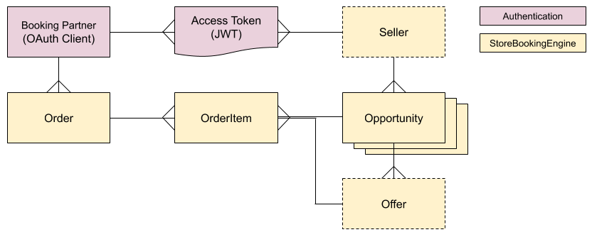
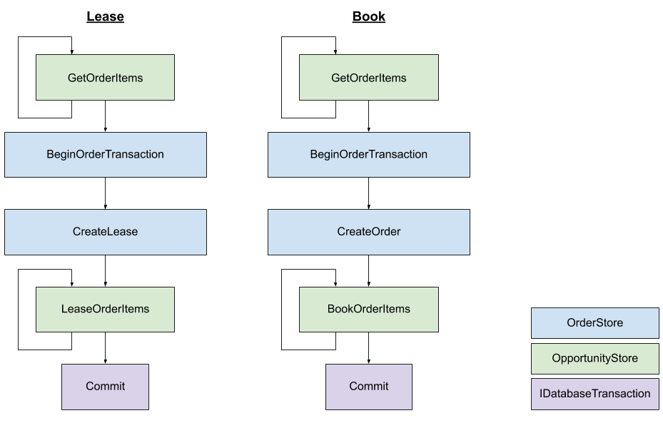
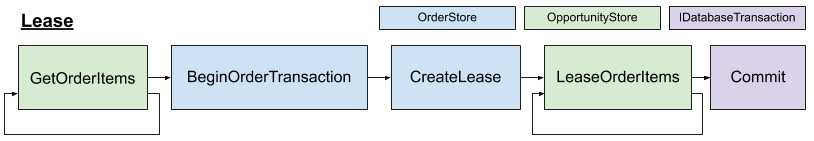
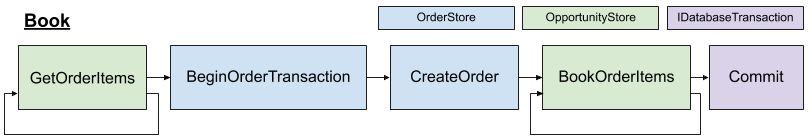

# Day 5: Leases and Booking

## Objective for Day 5

Implement leasing and booking.

### Rationale

With the details of the opportunities and the majority of the response collated in Day 4, Day 5 is about ensuring that leasing and booking actually occurs.

## Step 1: Ensure your database has a compatible schema

The Open Booking API includes concepts that likely map onto your existing schema, however your database schema may require slight adjustment in order to be compatible.



| Entity | Description |
| :--- | :--- |
| Order | A table representing the atomic successfully created `Order` which is the result of [**B**](https://www.openactive.io/open-booking-api/EditorsDraft/#order-creation-b). A lease flag can also be added to this table to allow it to also represent a leased `OrderQuote` \(for [C1](https://www.openactive.io/open-booking-api/EditorsDraft/#orderquote-creation-c1) and [C2](https://www.openactive.io/open-booking-api/EditorsDraft/#orderquote-creation-c2)\) or a separate table may be used for this purpose. This table likely also includes the booker \(`customer`\) details. This table is important as it is used to generate the [Orders feed](https://www.openactive.io/open-booking-api/EditorsDraft/#orders-rpde-feed) \(see [Day 6](day-6-orders-feed.md) for more information\). |
| OrderItem | A table representing an individual booking of an Opportunity within an `Order`.  This table likely also includes the guest checkout `attendee` details if these are supported. Existing "booking" or "attendee" tables may serve this purpose. Each `OrderItem` represents a booked space of [a 'bookable' Opportunity and Offer pair](https://www.openactive.io/open-booking-api/EditorsDraft/#definition-of-a-bookable-opportunity-and-offer-pair). |
| _Opportunity_ | One or many tables that represent the different [types of opportunity](https://developer.openactive.io/data-model/data-model-overview), some of which may be [bookable](https://www.openactive.io/open-booking-api/EditorsDraft/#definition-of-a-bookable-opportunity-and-offer-pair). |
| Offer | A table or other data structure that represents the available Offers within each Opportunity |
| Seller | A table that represents Sellers, organizations or individuals who organize the events or provide the facilities. Existing "organisation" tables may serve this purpose. This is only required if the booking system is multi-tenancy within the same database \(i.e. it supports multiple Sellers\). |
| AuthToken | This is likely to be managed by the authentication library, e.g. as JWT. See [Day 8](day-8-authentication.md) for more information. |
| Booking Partner | This is likely to be managed by the authentication library, e.g. as a table of OAuth Clients. See [Day 8](day-8-authentication.md) for more information. |

## Step 2: Understand the StoreBookingEngine booking flow

The `StoreBookingEngine` handles creation of the overall Lease or Order, as well as the booking of each `OrderItem`,  within a transaction.

The diagram below illustrates the abstract methods that are called by the `StoreBookingEngine`, noting that:

* The `OpportunityStore` used for calls to `GetOrderItems`, `LeaseOrderItems` and `BookOrderItems` for the set of `OrderItem`s of each opportunity type is based on the  `OpportunityStoreRouting` configured in [Day 3](day-3-test-data.md).
* The same `OrderItemContext` is passed untouched from `GetOrderItems` to either `LeaseOrderItems` or `BookOrderItems`, which allows logic to be executed inside or outside of the transaction as required.
* If an exception occurs after `BeginOrderTransaction`, `IDatabaseTransaction.Rollback()` is called.




## Step 3: Implement OrderStore

Create a new `OrderStore` implementation with stub methods.

Note that all methods except for `CustomerCancelOrderItems` will be implemented by the end this Day 5.

```csharp
public class MyCustomOrderStore : OrderStore<DatabaseTransaction>
{
    public override Lease CreateLease(Lease lease, OrderQuote responseOrderQuote, StoreBookingFlowContext flowContext, DatabaseTransaction databaseTransaction)
    {
        throw new NotImplementedException();
    }

    public override void CreateOrder(Order responseOrder, StoreBookingFlowContext flowContext, DatabaseTransaction databaseTransaction)
    {
        throw new NotImplementedException();
    }

    public override bool CustomerCancelOrderItems(OrderIdComponents orderId, SellerIdComponents sellerId, OrderIdTemplate orderIdTemplate, List<OrderIdComponents> orderItemIds)
    {
        throw new NotImplementedException();
    }

    public override void DeleteLease(OrderIdComponents orderId, SellerIdComponents sellerId)
    {
        throw new NotImplementedException();
    }

    public override void DeleteOrder(OrderIdComponents orderId, SellerIdComponents sellerId)
    {
        throw new NotImplementedException();
    }

    protected override DatabaseTransaction BeginOrderTransaction(FlowStage stage)
    {
        throw new NotImplementedException();
    }
}
```

Configure the `OrderStore` setting of  `StoreBookingEngineSettings` within `EngineConfig.cs` to use this new implementation of `SellerStore`:

```csharp
OrderStore = new MyCustomOrderStore(),
```

## Step 4: Implement Transactions

The `OrderStore` generic type has a parameter for a custom database transaction class, which can be used to wrap an existing transaction type \(such as `DbContextTransaction` within entity framework\), depending on your ORM or database.

Implement a new `IDatabaseTransaction` class, ensuring that the class is `sealed`, and that `Dispose()` is implemented correctly.

Within your new `OrderStore`, implement `BeginOrderTransaction` to return this new class.

```csharp
protected override EntityFrameworkOrderTransaction BeginOrderTransaction(FlowStage stage)
{
    return new EntityFrameworkOrderTransaction();
}
```

### Entity Framework Example

```csharp
public sealed class EntityFrameworkOrderTransaction : IDatabaseTransaction
{
    private OrderContext _context;
    private DbContextTransaction _dbContextTransaction;

    public EntityFrameworkOrderTransaction()
    {
        _context = new OrderContext();
        _dbContextTransaction = _context.Database.BeginTransaction();
    }

    public void Commit()
    {
        _context.SaveChanges();
        _dbContextTransaction.Commit();
    }

    public void Rollback()
    {
        _dbContextTransaction.Rollback();
    }

    public void Dispose()
    {
        // Note dispose pattern of checking for null first,
        // to ensure Dispose() is not called twice
        if (_dbContextTransaction != null)
        {
            _dbContextTransaction.Dispose();
            _dbContextTransaction = null;
        }

        if (_context != null)
        {
            _context.Dispose();
            _context = null;
        }
    }
}
```

## Step 5: Implement Leasing



The objective of this step is to implement `CreateLease` , `LeaseOrderItems`, and `DeleteLease`, while updating `BeginOrderTransaction` if necessary.

Use `CreateLease` to create an overall lease "container" for a collection of opportunities, if required by your system. `CreateLease` receives an immutable `flowContext`, which contains useful properties about the lease, and should contain enough data to satisfy most requirements for persisting a lease in a database. A Lease must be returned by `CreateLease` in order for `LeaseOrderItems` to be called.

To cater for edge cases: `CreateLease` also receives a mutable `responseOrderQuote`, which is the full `OrderQuote` response created so far. Note that the `OrderItems` will be overwritten by `LeaseOrderItems`, but all other properties may be updated if required, or can be read if useful when creating the lease "container" in the database.

Note that leases are time-bound, and so must be cleaned up if they expire \(e.g. on a schedule\). This must be handled outside of the `StoreBookingEngine`.

Use `LeaseOrderItems` to lease the individual opportunities. `LeaseOrderItems` follows a similar pattern to `GetOrderItems`, using lists of mutable `OrderItemContext` as described in [Day 4](day-4-c1-and-c2-without-leases.md#orderitemcontext-capabilities). Note that as per the Open Booking API specification **lease errors must not generate exceptions**; instead `AddError` is useful here, as in [Day 4](day-4-c1-and-c2-without-leases.md#orderitemcontext-capabilities), for adding any `OrderItem` level leasing errors to the response.

`OrderStore.DeleteLease` is called by the [OrderQuote Deletion endpoint](https://www.openactive.io/open-booking-api/EditorsDraft/#orderquote-deletion).

The Open Booking API specification [provides several options for leasing](https://www.openactive.io/open-booking-api/EditorsDraft/#leasing) an opportunity to a customer so that it cannot be booked by anyone else while the customer is completing their booking journey. The implementation of each is supported by the `StoreBookingEngine` through varying implementations of `BeginOrderTransaction`, `CreateLease` and `DeleteLease`, as described below.

### Option 1: Disable leasing

* Ensure that `BeginOrderTransaction` returns `null`, for `FlowStage.C1`  and `FlowStage.C2`.
* Ensure `CreateLease` always returns `null`, which will prevent `LeaseOrderItems` being triggered.
* `LeaseOrderItems` can throw `NotImplementedException`.
* Implement `DeleteLease` to do nothing \([as the specification requires a positive response for OrderQuote Deletion](https://www.openactive.io/open-booking-api/EditorsDraft/#orderquote-deletion), even if no lease exists\).

```csharp
protected override DatabaseTransaction BeginOrderTransaction(FlowStage stage)
{
    // No lease support
    if (stage == FlowStage.B)
    {
        return new OrderTransaction();
    }
    else
    {
        return null;
    }
}

public override Lease CreateLease(OrderQuote orderQuote, StoreBookingFlowContext context, DatabaseTransaction databaseTransaction)
{
    // No lease support
    return null;
}

public override void DeleteLease(OrderIdComponents orderId)
{
    // No lease support, simply do nothing here
}
```

### Option 2: Named leasing - lease at C2 only

Use conditional logic to return `null` from `BeginOrderTransaction` and `CreateLease` at `FlowStage.C1`.

Implement `CreateLease` to create a new lease in your database against the `flowContext.OrderId.uuid`.  

Implement `LeaseOrderItems` for each `OpportunityStore` to add the provided list of `OrderItemContext` identified by their `RequestBookableOpportunityOfferId` to the lease identified by `flowContext.OrderId.uuid`.

Implement `DeleteLease` to delete the lease based on the provided `orderId.uuid`, whilst always [ensuring a positive response for OrderQuote Deletion](https://www.openactive.io/open-booking-api/EditorsDraft/#orderquote-deletion), even if no lease exists.

Note that a  `Lease` object must be returned from `CreateLease` in order for the `LeaseOrderItems` within each `OpportunityStore` implementation to be executed.

```csharp
protected override DatabaseTransaction BeginOrderTransaction(FlowStage stage)
{
    if (stage != FlowStage.C1)
    {
        return new OrderTransaction();
    }
    else
    {
        return null;
    }
}
        
public override Lease CreateLease(OrderQuote orderQuote, StoreBookingFlowContext flowContext, DatabaseTransaction databaseTransaction)
{
    // In this example leasing is only supported at C2
    if (flowContext.Stage == FlowStage.C2)
    {
        var leaseExpires = DateTimeOffset.Now + new TimeSpan(0, 5, 0);
        
        var result = databaseTransaction.Database.AddLease(...);
    
        if (!result) throw new OpenBookingException(new OrderAlreadyExistsError());
    
        return new Lease
        {
            LeaseExpires = leaseExpires
        };
    }
    else
    {
        return null;
    }
}

public override void DeleteLease(OrderIdComponents orderId)
{
    FakeBookingSystem.Database.DeleteLease(orderId.uuid);
}
```

### Option 3: Anonymous leasing - lease at C1 and C2

Same as Option 2, without the conditional logic.

```csharp
protected override DatabaseTransaction BeginOrderTransaction(FlowStage stage)
{
    return new OrderTransaction();
}
        
public override Lease CreateLease(OrderQuote orderQuote, StoreBookingFlowContext flowContext, DatabaseTransaction databaseTransaction)
{
    // In this example leasing is supported at C1 and C2

    var leaseExpires = DateTimeOffset.Now + new TimeSpan(0, 5, 0);
    
    var result = databaseTransaction.Database.AddLease(...);

    if (!result) throw new OpenBookingException(new OrderAlreadyExistsError());

    return new Lease
    {
        LeaseExpires = leaseExpires
    };
}

public override void DeleteLease(OrderIdComponents orderId)
{
    FakeBookingSystem.Database.DeleteLease(orderId.uuid);
}
```

## Step 6: Run Test Suite for Leases


**Skip this step:** Note the OpenActive Test Suite does not yet include lease tests or lease expiry tests.


Lease tests should pass for C1 and C2.

Lease expiry tests should also pass.

## Step 7: Implement Booking



The objective of this step is to implement `CreateOrder` , `BookOrderItems`, and `DeleteOrder`, storing at least enough data to construct an Orders feed entry.

Use `CreateOrder` to create the `Order` that will feature in your Orders feed. `CreateOrder` receives an immutable `flowContext`, which contains useful properties about the `Order`, and should contain enough data to satisfy most requirements for persisting an `Order` in a database.

To cater for edge cases: `CreateOrder` also receives a mutable `responseOrder`, which is the full `Order` response created so far. Note that the `OrderItems` will be overwritten by `BookOrderItems`, but all other properties may be updated if required, or can be read if useful when creating the `Order` in the database.

Use `BookOrderItems` to book the individual opportunities. `BookOrderItems` follows a similar pattern to `GetOrderItems`, using lists of mutable `OrderItemContext` as described in [Day 4](day-4-c1-and-c2-without-leases.md#orderitemcontext-capabilities). Note that to conform with the Open Booking API specification **all booking errors must generate an exception**; so do not use `AddError`. For errors relating to capacity throw `OpenBookingException` with `OpportunityHasInsufficientCapacityError` or `OpportunityCapacityIsReservedByLeaseError` as appropriate,  or for other errors in `BookOrderItems` throw `OpenBookingException` with `UnableToProcessOrderItemError`.

`OrderItemContext` includes a method `SetOrderItemId` which **must** be used within `BookOrderItems` to set the `OrderItem` `Id` based on any completed bookings.

`OrderStore.DeleteOrder` is called by the [Order Deletion endpoint](https://www.openactive.io/open-booking-api/EditorsDraft/#order-deletion), and must soft-delete the `Order` \(such that it appears as "deleted" within the Orders feed\).

Finally, when concurrent transactions are used to write to tables that power RPDE feeds, there is a risk of a delayed item interleaving race condition occurring. Ensure your Orders table updates \(and Orders RPDE query in [Day 6](day-6-orders-feed.md)\) implement the [prevention strategies outlined here](https://developer.openactive.io/publishing-data/data-feeds/implementing-rpde-feeds#transactions-preventing-delayed-item-interleaving). 

## Step 8: Run Test Suite for Booking

The [simple-book-free-opportunities](https://github.com/openactive/openactive-test-suite/blob/master/packages/openactive-integration-tests/test/features/core/simple-book-free-opportunities/README.md) and [simple-book-with-payment](https://github.com/openactive/openactive-test-suite/blob/master/packages/openactive-integration-tests/test/features/payment/simple-book-with-payment/README.md) features within the `openactive-integration-tests` test suite should pass.

Run these tests in isolation as follows:

```text
npm start -- --runInBand test/features/core/simple-book-free-opportunities/ test/features/payment/simple-book-with-payment/
```


