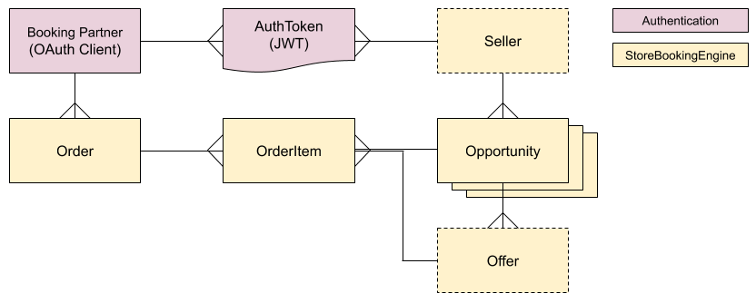
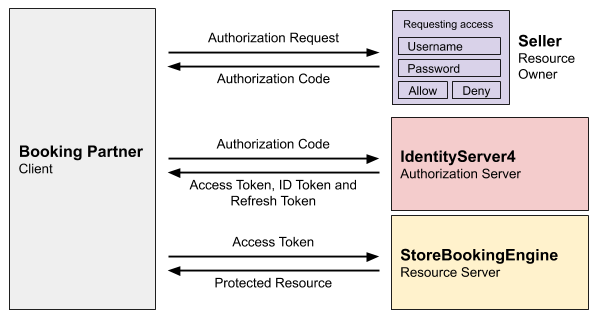

# Day 8: Authentication


**Note: This functionality is not yet stable, and its release is pending feedback on Day 1-7, and on the design below.**


## Objective for Day 8

Configure OpenID Connect and OAuth 2.0 authentication using [IdentityServer4](https://identityserver.io/) to allow Booking Partners to easily and securely gain access to book on behalf of Sellers.

### Rationale

[OpenID Connect](https://openid.net/connect/) and OAuth 2.0 are the Open Booking API recommendation for authentication, as it most easily fulfils the requirements of the specification and is also very widely supported and well understood. Security best practice recommends against creating your own security layer and instead suggests leveraging existing tried-and-tested standards and libraries. IdentityServer4 is the most widely supported option for implementing OpenID Connect and OAuth 2.0 in .NET.

## Guides available

This page covers the overall approach to using OAuth 2.0 and OpenID Connect for the Open Booking API. 

Read this page first, then jump to the appropriate guide:





## Boundaries of responsibility

As you have seen in Day 1 and Day 5, the `StoreBookingEngine` does not include any authentication functionality by design. The endpoint bindings to the StoreBookingEngine accept the `clientId` and `sellerId`, which are expected to be provided by the authentication layer \(shown in red on the diagram below\).  



| Entity | Description |
| :--- | :--- |
| AuthToken \(JWT\) | IdentityServer4 allows AuthTokens  to contain custom claims, such as the `sellerId` and `clientId`. |
| Booking Partner \(OAuth Client\) | IdentityServer4 manages this as a table of OAuth Clients. |

## Endpoint Access Tokens

An OAuth **scope** defines access to a set of endpoints \(and also expectations about claims returned, see later\). 

An **Access Token** that includes the required scope \(and which may be acquired via the required flow\) must be included in the Authorization header of the request to access the Open Booking API endpoints:

<table>
  <thead>
    <tr>
      <th style="text-align:left">Flow</th>
      <th style="text-align:left">Scope</th>
      <th style="text-align:left">Endpoints</th>
    </tr>
  </thead>
  <tbody>
    <tr>
      <td style="text-align:left">No authentication</td>
      <td style="text-align:left">N/A</td>
      <td style="text-align:left">
        <p>Dataset Site</p>
        <p>Open Data RPDE feeds</p>
      </td>
    </tr>
    <tr>
      <td style="text-align:left">OpenID Connect Authorization Code Flow</td>
      <td style="text-align:left"><code>openactive-openbooking</code>
      </td>
      <td style="text-align:left">
        <p>OrderQuote Creation (C1)</p>
        <p>OrderQuote Creation (C2)</p>
        <p>OrderQuote Deletion</p>
        <p>Order Creation (B)</p>
        <p>Order Deletion</p>
        <p>Order Cancellation</p>
        <p>Order Status</p>
      </td>
    </tr>
    <tr>
      <td style="text-align:left">Client Credentials flow</td>
      <td style="text-align:left"><code>openactive-ordersfeed</code>
      </td>
      <td style="text-align:left">Orders RPDE Feed</td>
    </tr>
  </tbody>
</table>### OpenID Connect Authorization Code Flow \(`openactive-openbooking`\)

To call endpoints specific to the Seller, the Booking Partner must first acquire a valid **Access Token** with an `openactive-openbooking` scope, by having the Seller complete the Authorization Code Flow. Sellers will be familiar with this flow from websites that offer "Login with my Google Account".

A **Refresh Token** is also provided during this flow, which allows the Booking Partner to request another Access Token once it has expired, without the Seller needing to reauthenticate.

Additionally, a "one-time usage" **ID Token** is provided during this flow which contains the SellerId and other details of the Seller. This allows the Booking Partner to store the Access Token and Refresh Token against the correct SellerId in their database, so they can use it when booking the Seller's opportunities.

To complete this flow, the Authorization Request must include both the `openactive-openbooking` and `openid` scopes, to ensure that an ID Token is returned.



### Client Credentials Flow \(`openactive-ordersfeed`\)

The straightforward Client Credentials Flow can be used to retrieve an **Access Token** with an `openactive-ordersfeed` scope, which grants access to the Orders Feed endpoint as above.

To complete this flow, the Authorization Request must include only the `openactive-ordersfeed` scope.


## Step X: Understanding the OAuth Subject

The OAuth subject is recommended to not be the end user who is following the OAuth flow, but is instead the Seller that they represent - such that if, for example, the end user no longer works for the Seller and deletes their account, their authentication grants remain unaffected. This recommendation conforms with OpenID Connect from a technical perspective, which is useful when leveraging existing libraries.

## Step X: Understanding claims and scopes

### Scopes

The `openactive-openbooking` and `openid` scopes must be used to grant access to both the OpenID Connect authorisation endpoints, and the Open Booking API endpoints.

The `openactive-openbooking` scope also includes a request for the claims listed below.

### idToken claims

The idToken is designed to be read by the Booking Partner to give them information about the Seller that has just authenticated.

The following claims are for use by the booking partner, and must conform to the custom claim names specified below.

The custom claim name is collision-resistant in accordance with the OIDC specification. 

| Claim | Description | Exactly matches |
| :--- | :--- | :--- |
| `https://openactive.io/sellerName` | The seller name. | `name` of  `seller` |
| `https://openactive.io/sellerLogo` | A URL of the logo of the Seller. | `logo` of  `seller` |
| `https://openactive.io/sellerUrl` | The URL of the website of the Seller. | `url` of  `seller` |
| `https://openactive.io/sellerId` | The Seller ID as a JSON-LD ID. Also allows for compatibility with existing authentication implementations which might be using "sub" to include a different identifier. Booking partners will use this to determine which Seller ID the provided accessToken is intended for.  | `id` of  `seller` |
| `https://openactive.io/bookingServiceName` | The `name` of the Booking System | `name` of  `bookingService` |
| `https://openactive.io/bookingServiceUrl` | The `url` of the website of the Booking System | `url` of  `bookingService` |

The booking partner will include "https://openactive.io/sellerId" in the ["claims" Request Parameter](https://openid.net/specs/openid-connect-core-1_0.html#ClaimsParameter), and the booking system must include this claim when requested and may include this claim by default.

### accessToken claims

These claims are useful for internal implementation, and are simply a recommendation. This claims do not need to be standardised as long as they are internally consistent.

Additionally the token may be either a [self-contained or reference token](http://docs.identityserver.io/en/latest/topics/reference_tokens.html), as it is opaque to the booking partner, however a self-contained token simplifies implementation with IdentityServer4.

| Custom claim | Description | Flows |
| :--- | :--- | :--- |
| `https://openactive.io/clientId` | Recommended to be used for the booking partner Client ID that requested the toke. Note that "[cid](https://developer.okta.com/docs/reference/api/oidc/#access-token-scopes-and-claims)", "client\_id" and similar custom claims may also be available in the libraries you are using by default, and so may be used. Also note that this claim is due to be featured in the future OAuth 2.0 specification: [https://tools.ietf.org/html/draft-ietf-oauth-token-exchange-19\#section-4.3](https://tools.ietf.org/html/draft-ietf-oauth-token-exchange-19#section-4.3).  | Authorization Code Flow and Client Credentials flow |
| `https://openactive.io/sellerId` | Recommended to be used for the Seller ID, which is useful to be provided to your endpoints to determine which seller the authToken is intended for. It is also consistent with the claim used in the idToken. | Authorization Code Flow only |

## Step X+1: Configuring custom claims

### IdentityServer4

This is achieved with a custom ProfileService:

[https://stackoverflow.com/questions/44761058/how-to-add-custom-claims-to-access-token-in-identityserver4](https://stackoverflow.com/questions/44761058/how-to-add-custom-claims-to-access-token-in-identityserver4)

### Auth0

If you are using Auth0 for authentication, the following [rule](https://auth0.com/docs/api-auth/tutorials/adoption/scope-custom-claims) will allow the additional claims to be included in the relevant tokens:

```javascript
function (user, context, callback) {
  const namespace = 'https://openactive.io/';
  const sellerIdBaseUrl = 'https://example.com/api/sellers/';
  context.accessToken[namespace + 'sellerId'] = sellerIdBaseUrl + user.user_id;
  context.accessToken[namespace + 'clientId'] = context.clientID;
  context.idToken[namespace + 'sellerId'] = sellerIdBaseUrl + user.user_id;
  callback(null, user, context);
}
```

## Using Tokens

Endpoints accept tokens for each request, including the clientId and the sellerId

Flowchat of different flows \(based on Stripe's graphics\)

Include what "claims" are \(key value pairs\), and also what "scopes" are

## Step 2: Configure AuthToken expiry

An expiry duration of 15 minutes is recommended for AuthToken expiry, to give the Seller control over the relationship.

[https://stackoverflow.com/questions/35304038/identityserver4-register-userservice-and-get-users-from-database-in-asp-net-core](https://stackoverflow.com/questions/35304038/identityserver4-register-userservice-and-get-users-from-database-in-asp-net-core)

