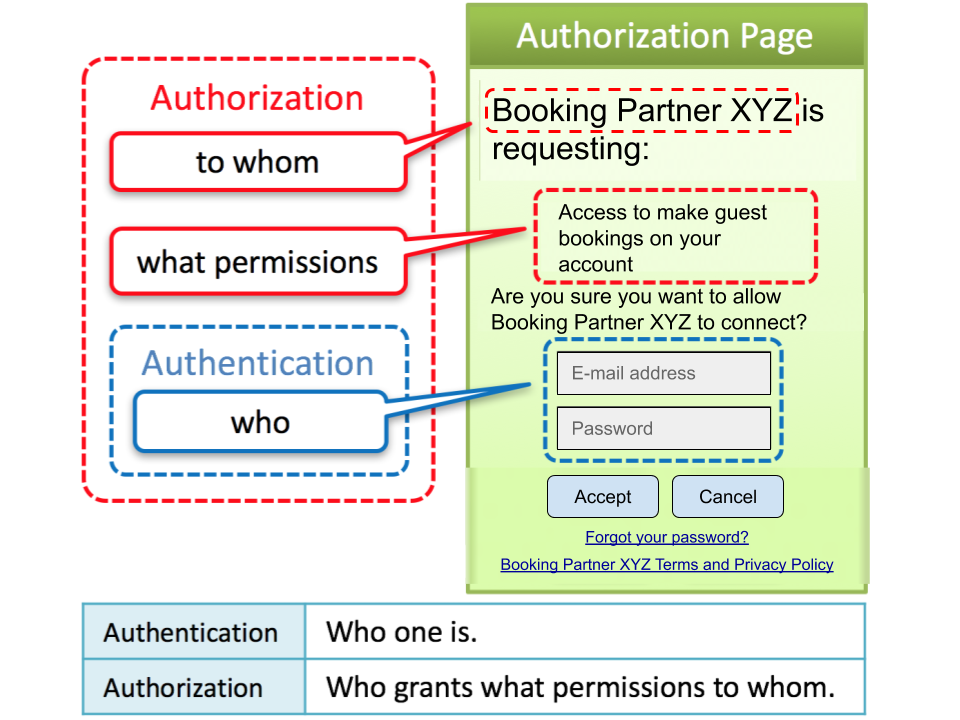
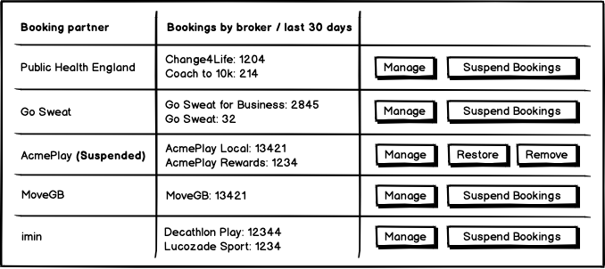
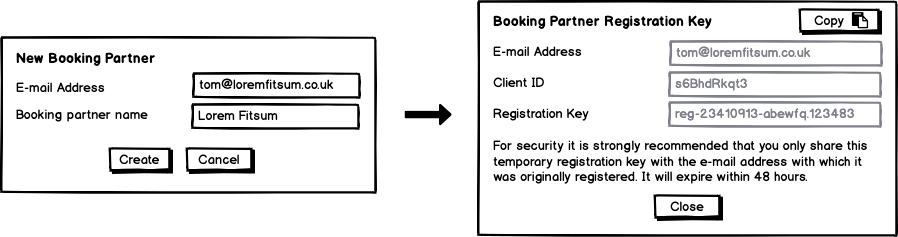
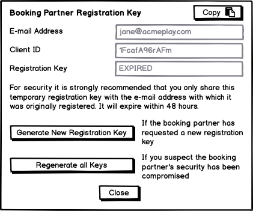

# Day 8: Authentication


**Note: This functionality is not yet stable, and its release is pending feedback on Day 1-7, and on the design below.**


## Objective for Day 8

Configure OpenID Connect and OAuth 2.0 authentication using [IdentityServer4](https://identityserver.io/) to allow Booking Partners to easily and securely gain access to book on behalf of Sellers.

### Rationale

[OpenID Connect](https://openid.net/connect/) and OAuth 2.0 are the Open Booking API recommendations for authentication, as they most easily fulfils the requirements of the specification and are also very widely supported and well understood. Security best practice recommends against creating your own security layer and instead suggests leveraging existing tried-and-tested standards and libraries. IdentityServer4 is the most widely supported option for implementing OpenID Connect and OAuth 2.0 in .NET.

## Guides available

This page covers the overall approach to using OAuth 2.0 and OpenID Connect for the Open Booking API. 

Read this page first, then jump to the appropriate guide:





## Boundaries of responsibility

As you have seen in Day 1 and Day 5, the `StoreBookingEngine` does not include any authentication functionality by design. The endpoint bindings to the StoreBookingEngine accept the `clientId` and `sellerId`, which are expected to be provided by the Access Token in the authentication layer \(shown in red on the diagram below\).  

| Entity | Description |
| :--- | :--- |
| Access Token \(JWT\) | IdentityServer4 allows AuthTokens  to contain custom claims, such as the `sellerId` and `clientId`. |
| Booking Partner \(OAuth Client\) | IdentityServer4 manages this as a table of OAuth Clients. |
| Seller | This is **only required** if the booking system supports **multiple Sellers** \(i.e. is multi-tenancy within the same database\). |

## Endpoint Scopes

An OAuth **scope** defines access to a set of endpoints \(and also expectations about claims returned, see [later](./#claims)\). 

An **Access Token** that includes the required scope \(and which may be acquired via the required flow\) must be included in the Authorization header of the request to access the Open Booking API endpoints:

<table>
  <thead>
    <tr>
      <th style="text-align:left">Scope</th>
      <th style="text-align:left">Endpoints</th>
      <th style="text-align:left">OAuth flow used to acquire Access Token</th>
    </tr>
  </thead>
  <tbody>
    <tr>
      <td style="text-align:left">No authentication</td>
      <td style="text-align:left">
        
Dataset Site

        
Open Data RPDE feeds

      </td>
      <td style="text-align:left">N/A</td>
    </tr>
    <tr>
      <td style="text-align:left"><code>openactive-openbooking</code>
      </td>
      <td style="text-align:left">
        
OrderQuote Creation (C1)

        
OrderQuote Creation (C2)

        
OrderQuote Deletion

        
Order Creation (B)

        
Order Deletion

        
Order Cancellation

        
Order Status

      </td>
      <td style="text-align:left">
        
<a href="./#openid-connect-authorization-code-flow">OpenID Connect Authorization Code Flow</a>
           (for Multiple Sellers)

        

        
<a href="./#client-credentials-flow">Client Credentials flow</a>
           (for Single Seller)

      </td>
    </tr>
    <tr>
      <td style="text-align:left"><code>openactive-ordersfeed</code>
      </td>
      <td style="text-align:left">Orders RPDE Feed</td>
      <td style="text-align:left"><a href="./#client-credentials-flow">Client Credentials flow</a>
      </td>
    </tr>
    <tr>
      <td style="text-align:left"><code>oauth-dymamic-client-update</code>
      </td>
      <td style="text-align:left">Dynamic Client Update</td>
      <td style="text-align:left">N/A</td>
    </tr>
  </tbody>
</table>

## OAuth Flows

The preferred approach for booking systems that support multiple Sellers is to provide your Sellers with an OpenID Connect Authorization Code flow to approve booking partners. A simplified Client Credentials flow is available for booking systems supporting a single Seller, and is also used to provide access to the Orders feed in both cases.

### OpenID Connect Authorization Code Flow \(for booking systems with multiple Sellers\)

To call endpoints specific to the Seller when the booking system supports multiple Sellers, the Booking Partner must first acquire a valid **Access Token** with an `openactive-openbooking` scope, by having the Seller complete the Authorization Code Flow. Sellers will be familiar with this flow from websites that offer "Login with my Google Account".

Note however that to complete this flow, the Authorization Request must include both the `openactive-openbooking` and `openid` scopes, to ensure that an ID Token is returned.

A **Refresh Token** is also provided during this flow, which allows the Booking Partner to request another Access Token once it has expired, without the Seller needing to reauthenticate.

Additionally, a "one-time usage" **ID Token** is provided during this flow which contains the SellerId and other details of the Seller. This allows the Booking Partner to store the Access Token and Refresh Token against the correct SellerId in their database, so they can use these when booking the Seller's opportunities.

For this flow, the OpenID Connect subject is recommended **not to be the end user** who is following the OAuth flow, but is instead the **Seller** that they represent - such that if, for example, the end user no longer works for the Seller and deletes their account, their authentication grants remain unaffected. This recommendation conforms with OpenID Connect from a technical perspective, which is useful when leveraging existing libraries.

### Client Credentials Flow \(for all booking systems\)

The straightforward Client Credentials Flow can be used to retrieve an **Access Token** with an `openactive-ordersfeed` scope, which grants access to the Orders Feed endpoint as above.

The Client Credentials Flow can also be used to retrieve an Access Token ****with an `openactive-openbooking` scope, for cases where the booking system only supports a single Seller.

To complete this flow, the Authorization Request must include only the `openactive-ordersfeed` scope.

## Dynamic Client Registration Management

In order to simplify implementation and administration of booking partner management, as well as to increase security, use of the [OAuth 2.0 Dynamic Client Registration Management Protocol](https://tools.ietf.org/html/rfc7592) is recommended. This does not allow the automatic creation of new booking partners \(this is a feature of the separate but related [OAuth 2.0 Dynamic Client Registration Protocol](https://tools.ietf.org/html/rfc7591)\), but instead allows  the configuration data of existing booking partners to be updated by the booking partners themselves using a special short-lived Registration Access Token. This approach is a leaner version of the [Dynamic Client Registration approach used by Open Banking](https://openbanking.atlassian.net/wiki/spaces/DZ/pages/937066600/Dynamic+Client+Registration+-+v3.1).

The approach provides three key benefits:

1. **Simplify administration**: In the absence of a developer portal, this greatly simplifying the number of fields to be copy/pasted from e-mail exchanges with each booking partner, reducing the potential for introducing configuration errors and taking unnecessary support time, and allowing the booking partner to easily make changes and amendments during their initial setup.
2. **Simplify implementation**: The UI required for booking partner administration can be greatly simplified, as only a limited number of fields need to be configured, and a developer portal is not required.
3. **Increase security:** The sport and physical activity sector is notorious for transmitting long-lived sensitive credentials via email. The Dynamic Client Registration Management approach ensures that the most sensitive credentials \(the "client secret"\) are not given to the Seller to be sent in an email, and are instead always transmitted securely \(via HTTPS\). A short-lived \(e.g. 48 hours\) registration access token is available to be sent via email, which creates limited exposure. The registration access token will disable all access to the booking partner if compromised, and hence facilitates detection of any attack.

It is strongly recommended that ONLY the [Client Update ](https://tools.ietf.org/html/rfc7592#section-2.2)endpoint be implemented, and that it generates a new Client Secret on every call \(in accordance with the specification\).

The OAuth 2.0 Dynamic Client Registration Management Protocol is [not included natively in IdentityServer4](https://github.com/IdentityServer/IdentityServer4/issues/1248), as it is generally considered an "admin" API. Hence, to simplify implementation, the StoreBookingEngine provides an endpoint binding and store for this. 

## Booking partner management

Assuming the booking system decides to follow the best practices outlined above according to their architecture \(single/multiple Sellers\), this section includes recommended front-end features for the administration of booking partners. 

### Booking systems supporting Multiple Sellers

For multiple Sellers, the OAuth flow is initiated by the Booking partner, and in line with other services like Google or Facebook, the Seller only sees a list of  the booking partners that they have explicitly authorised.

The booking system may also choose to display a "marketplace" of all available booking partners \(based on those registered with the booking system\), however a design for this is not included here.

The booking system may consider providing statistics relating to bookings made via brokers within each booking partner.

#### Seller administration page

Booking Systems supporting multiple Sellers should provide a view of all the Seller's approved booking partners.

#### Booking System administration page

Booking Systems may also provide a dashboard for their own administration, with a view of all booking partners that have been registered as OAuth clients.

### Booking systems supporting a Single Seller

Booking Systems supporting a single Sellers should provide a view of all the Seller's approved booking partners, which is also a list of OAuth clients.

Suspend Bookings revokes access to the `openactive-openbooking` scope, so that only the Orders feed is accessible.

### "Manage"

Open the booking partners' own settings page, available on their own website.

* From a technical perspective: this simply links to the Management URL that is provided when the booking partner registers their OpenID Connect Client.

### "Suspend Bookings"

Temporarily suspend new bookings and customer requested cancellations, but allow provider requested cancellations, refunds and customer notifications to continue as normal. This is designed to give the Seller a mechanism of control in the case of a contract dispute with the booking partner.

* From a technical perspective: 
  * Multiple Sellers: this simply revokes the refresh token provided to the booking partner for this seller.
  * Single Seller: this revokes the booking partner's access token with the `openactive-openbooking` scope, and only permits a new access token to be generated with an `openactive-ordersfeed` scope.
* Confirmation message: 
  * Multiple Sellers: "Warning: this will prevent any new bookings or cancellations being made to existing bookings via this booking partner. If you believe the booking partner's security has been breached, please additionally contract \[booking system support\]. Are you sure you want to continue?"
  * Single Seller: "Warning: this will prevent any new bookings or cancellations being made to existing bookings via this booking partner. If you believe the booking partner's security has been breached, consider Regenerating API Keys instead. Are you sure you want to continue?"

### "Restore"

The inverse of the "Suspend Bookings" action, to restore access to the booking partner to make new bookings and customer requested cancellations.

* From a technical perspective:
  * Multiple Seller Mode: this button simply opens the Restore Access URL provided when the booking partner registers their OpenID Connect Client, which causes them to go through the OpenID Connect flow to attain a new refresh token.
  * Single Seller Mode: this button restores ability to request an access token with the `openactive-openbooking` scope

### "Remove"

Completely remove the booking partners' access to the Seller. This will delete all Order data from the booking partner, prevent customers from getting notifications about changes or cancellations to existing bookings that have been made via this booking partner, and prevent them getting refunds via the booking partner. Once completed, the operation is not reversible. All existing Orders for this booking partner will be converted to the booking system's native guest bookings, and customers will receive native booking system notifications via email ongoing. If permission restored to the booking partner some time later, access to previously created Orders will not be available.

* From a technical perspective: This first checks that sufficient time has lapsed since "Suspend Booking" was used for the authToken to have expired, and displays a message with the remaining duration if not.  If sufficient time has lapsed, it sets all of the Seller's Orders from the booking partner in the Orders feed to "deleted", and reassigns them to be "native" booking system bookings.
* To simplify implementation, "Remove" is only possible after the booking partner has been suspended for the full Access Token expiry duration, as this removes the requirement for asynchronous logic.
* Includes a confirmation message: "Warning: this will transfer all bookings made via this booking partner into \[booking system\] as standard bookings, and remove the booking partner's access to make further bookings on your behalf. This cannot be undone. Are you sure you want to continue?"

### "Delete"

Performs the same operation as "Remove" except it also revokes all access tokens and deletes the Client ID.

### "Add Booking Partner" - New Booking Partner creation

In the Booking System administration page, clicking "Add Booking Partner" should open a form that allows the E-mail address of the booking partner, and the booking partner name to be specified, with a "Create" button to continue.

Once the "Create" button is pressed the Client ID and Registration Access token is generated and displayed. These are designed to be e-mailed to the Booking Partner.

It is recommended that an anti-phishing notice is displayed to remind the user to only send credentials to the designated email address, to reduce the risk of the credentials being leaked to a malicious party.

The booking partners name is then displayed in the Booking System administration page in a "pending" state until the Dynamic Client Update endpoint is called.

### "API Key" - Booking Partner configuration updates

Clicking the "API Key" button of the Booking Partner within the Booking System administration page displays the following:

#### Generate New Registration Key

The Booking Partner may request a new Registration Access Token if they wish to update their configuration and their existing token has expired.

#### Regenerate all keys 

Regenerates the Client Secret and the Registration Access Token. It is designed to be used in cases where the security of the booking partner is in question. The booking partner must use the newly generated Registration Access Token to retrieve a new Client Secret, in order to re-establish a connection.

This displays a confirmation dialog explaining: "Warning: This will revoke all access to your booking system from the booking partner until they are able to use the newly generated Registration Access Token to regain access. Existing bookings will be unaffected. Are you sure you want to continue?".

## Access Token expiry

An expiry duration of 15 minutes is recommended for Access Token expiry, to give the Seller control over the relationship.

## Custom Claims

**Claims** are simply key-value pairs that are included in Access Tokens and ID Tokens; each claim is "claiming" a fact about the subject \(in this case, the Seller\). For example a token may include a "claim" that the Seller has a name of "Fusion Lifestyle".

### ID Token claims

The ID Token is designed to be read by the Booking Partner to give them information about the Seller that has just authenticated.  This allows the Booking Partner to store the Access Token and Refresh Token against the correct SellerId in their database, so they can use these when booking the Seller's opportunities.

The `openactive-openbooking` scope includes an implicit request that claims listed below are included in the ID Token.

The following custom claims are for use by the booking partner, and must conform to the custom claim names specified below. The custom claim names are collision-resistant in accordance with the OIDC specification. 

| Custom claim | Description | Exactly matches |
| :--- | :--- | :--- |
| `https://openactive.io/sellerName` | The seller name. | `name` of  `seller` |
| `https://openactive.io/sellerLogo` | A URL of the logo of the Seller. | `logo` of  `seller` |
| `https://openactive.io/sellerUrl` | The URL of the website of the Seller. | `url` of  `seller` |
| `https://openactive.io/sellerId` | The Seller ID as a JSON-LD ID. Also allows for compatibility with existing authentication implementations which might be using "sub" to include a different identifier. Booking partners will use this to determine which Seller ID the provided accessToken is intended for.  | `id` of  `seller` |
| `https://openactive.io/bookingServiceName` | The `name` of the Booking System | `name` of  `bookingService` |
| `https://openactive.io/bookingServiceUrl` | The `url` of the website of the Booking System | `url` of  `bookingService` |

### Access Token claims

To help simplify the implementation, it is recommended that Access Tokens \(which are used to authenticate each request\) include the following custom claims.

The Access Token is only read internally by the Booking System, and so these claims are simply a recommendation. Hence the claim names do not need to be standardised as long as they are internally consistent.

Additionally the **Access Token** may be either a [self-contained or a reference token](http://docs.identityserver.io/en/latest/topics/reference_tokens.html), as it is opaque to the booking partner, however a self-contained token simplifies implementation with IdentityServer4.

<table>
  <thead>
    <tr>
      <th style="text-align:left">Custom claim</th>
      <th style="text-align:left">Description</th>
      <th style="text-align:left">Scopes</th>
    </tr>
  </thead>
  <tbody>
    <tr>
      <td style="text-align:left"><code>https://openactive.io/clientId</code>
      </td>
      <td style="text-align:left">Recommended to be used for the booking partner Client ID that requested
        the Access Token. Note that &quot;<a href="https://developer.okta.com/docs/reference/api/oidc/#access-token-scopes-and-claims">cid</a>&quot;,
        &quot;client_id&quot; and similar custom claims may also be available in
        the libraries you are using by default, and so may be used instead. Also
        note that this claim is due to be featured in a future OAuth 2.0 specification:
        <a
        href="https://tools.ietf.org/html/draft-ietf-oauth-token-exchange-19#section-4.3">https://tools.ietf.org/html/draft-ietf-oauth-token-exchange-19#section-4.3</a>.</td>
      <td
      style="text-align:left">
        
<code>openactive-openbooking</code> and <code>openactive-ordersfeed </code>and

        
<code>oauth-dymamic-client-update</code>
        

        </td>
    </tr>
    <tr>
      <td style="text-align:left"><code>https://openactive.io/sellerId</code>
      </td>
      <td style="text-align:left">Recommended to be used for the Seller ID, which is useful to be provided
        to your endpoints to determine which seller the Access Token is intended
        for. It is also consistent with the claim name used in the ID Token.</td>
      <td
      style="text-align:left"><code>openactive-openbooking</code>
        </td>
    </tr>
  </tbody>
</table>

